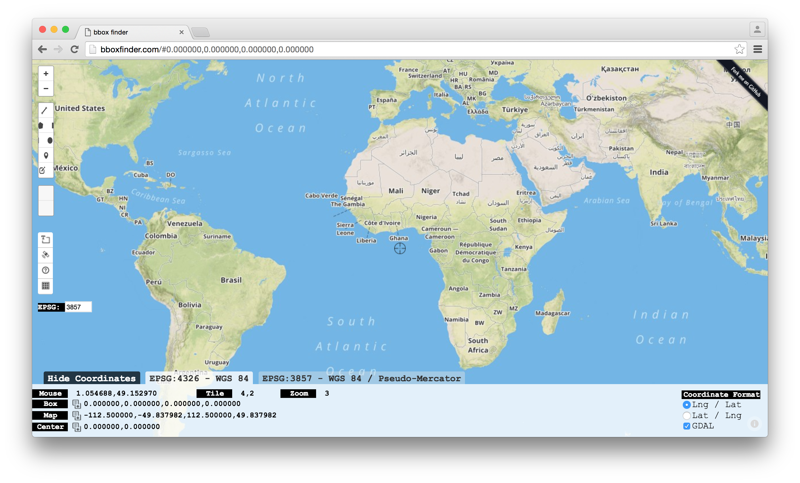
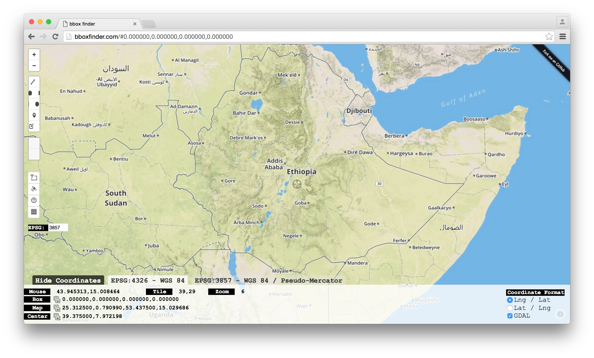
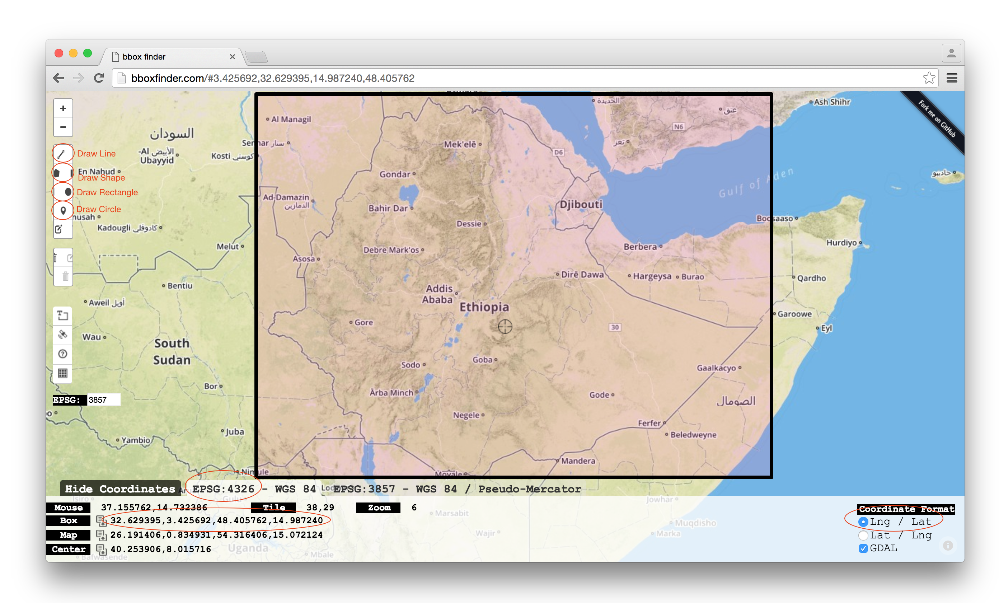

## Creating Your Own Mobile Basemap

The OpenMapKit has the ability to host map tiles on the phone even when it is disconnected from the Internet. This section shows you how to generate offline tiles to be used on the phone. The OMK team is working on an improved provisioning workflow, but until that's done use the steps below. 

MBTiles is a format made by the folks at [Mapbox](https://www.mapbox.com/) that allows you to store PNG or vector tile sets as a single file. An MBTiles file is actually a SQLite database that follows a specific schema. Check out the [spec](https://github.com/mapbox/mbtiles-spec) to learn more about it.

For the purpose of OpenMapKit, you can easily scrape PNG tiles from an online endpoint and store them in an MBTiles file with a few NodeJS command-line tools.

#### Installing Node.js
If you don't have NodeJS, the latest version can be downloaded [here](https://nodejs.org/en/). Install the package from the .dmg using the install wizard, this will install both node and [npm](https://www.npmjs.com/). npm stands for Node Package Manager and it is NodeJS' package ecosystem. Once downloaded and installed, you can double check the install was successful by entering `node` in the command line, this will open a node javascript session:

```
node
> console.log('hello node');
hello node
undefined
>
```

To exit the node.js session, hit 'control' + 'c' twice.

These instructions are a summary of an install guide (for OSX), additional steps and the original guide can be found [here](http://www.coolestguidesontheplanet.com/installing-node-js-on-osx-10-10-yosemite/).

#### Scraping an Online HTTP Tile Endpoint

A node module called [tl](https://www.npmjs.com/package/tl) allows you to scrape an HTTP map tile endpoint for PNG tiles and stuffs them into an MBTiles file. You can install it with the following command:

```
npm install -g tl mbtiles tilelive-http
```

Now you will have `tl` installed as a globally accessible executable (can be run in any folder) in your shell environment. Switch to whatever directory you want to save your MBTiles file to. The following command will scrape tiles from the Humanitarian OSM Basemap endpoint for Dhaka, Bangladesh.

```
tl copy -z 13 -Z 19 -b '90.375853 23.700965 90.437307 23.754632' 'http://c.tile.openstreetmap.fr/hot/{z}/{x}/{y}.png' mbtiles://./dhaka.mbtiles
```

* `-z` is the minimum zoom
* `-Z` is the maximum zoom
* `'90.375853 23.700965 90.437307 23.754632'` is the bounding box
    * The format for the bounding box is `'southWestLng southWestLat northEastLng northEastLat'`
* `'http://c.tile.openstreetmap.fr/hot/{z}/{x}/{y}.png'` is the http endpoint for the tiles
* `mbtiles://./dhaka.mbtiles` is the MBTiles file the scraped PNGs will be saved to

#### Generating MBTiles for Your Own Bounding Box

If you would like to choose your own bounding box, go to [bboxfinder](http://bboxfinder.com/#0.000000,0.000000,0.000000,0.000000). 
 
Using the zoom tools in the upper left corner zoom to your area of interest, for this example it is zoomed in to Ethiopia.

You can draw your bounding box in 3 ways: drawing a line, drawing a shape, drawing a rectangle or drawing a circle. In this case, the rectangle tool was used. Along the bottom, the bounding box coordinates are shown. Make sure that the **EPSG** is 4326 and the **Coordinate Format** is in *Lng / Lat*

Copy the bounding box coordinates into your command, make sure you remove the commas and replace them with a space. 
```
tl copy -z 13 -Z 19 -b '32.629395 3.425692 48.405762 14.987240' 'http://c.tile.openstreetmap.fr/hot/{z}/{x}/{y}.png' mbtiles://./ethiopia.mbtiles
```

#### Pre-generated Offline MBTiles Basemaps

Below is a list of links to previously generated MBTiles files to get you started. All you need to do to use them is to drag and drop them into the `openmapkit/mbitles` directory on your Android phone.

##### Humanitarian OpenStreetMap Examples

* [Dvizarasekwa, Harare, Zimbabwe - Mar 24 2015](https://www.dropbox.com/s/bcyg1qkdl502evn/dvziarasekwa-hot-all20.mbtiles)
    * Zoom 12 - 22 (Actually only fetched through 20)
    * Bounding Box: 30.885143 -17.824980 30.967541 -17.784733
    * Command: `tl copy -z 13 -Z 22 -b '30.885143 -17.824980 30.967541 -17.784733' 'http://a.tile.openstreetmap.fr/hot/{z}/{x}/{y}.png' mbtiles://./dvizarasekwa-hot.mbtiles`
* [Dhaka, Bangladesh - Jan 2 2015](https://www.dropbox.com/s/0vgkkgtcnwpjzs1/dhaka2015-01-02.mbtiles)
    * Zoom 13 - 19
    * Bounding Box: 90.375853 23.700965 90.437307 23.754632

##### Standard OpenStreetMap

* [Dvizarasekwa, Harare, Zimbabwe - Mar 6 2015]
    * Zoom 13 - 20
    * Bounding Box: -17.820934970719602 30.90642929077148 -17.788573952710493 30.944967269897
    * Command: `tl copy -z 13 -Z 20 -b '30.885143 -17.824980 30.967541 -17.784733' 'http://a.tile.openstreetmap.org/{z}/{x}/{y}.png' mbtiles://./dvizarasekwa-osm.mbtiles`

* [Harare, Zimbabwe - Mar 6 2013]
    * Zoom 13 - 20
    * Bounding Box: 
    * Command: `tl copy -z 13 -Z 20 -b '30.390930 -18.195434 31.709290 -17.551736' 'http://a.tile.openstreetmap.org/{z}/{x}/{y}.png' mbtiles://./harare-osm.mbtiles`

#### Preview MBTiles Locally

You can use [tessera](https://github.com/mojodna/tessera) to locally serve your MBTiles file to allow you to preview the basemap you have scraped.

To install:

```
npm install -g tessera
```

```
npm install -g mbtiles
```

Then, `cd` to the directory with your MBTiles file. To serve, execute:

```
tessera mbtiles://./whatever.mbtiles
```

This will give you an IP address at which you can see your MBtiles.

#### Adding MBtiles to Your Android Device

In order to use your MBtiles on the OMK mobile application, you must copy the MBtiles from your computer to the OMK app on your Andriod device.

##### Windows

If you are transferring from Windows to your Android device, plug the device into the computer and then drag-n-drop the MBtiles from your computer to the openmapkit/mbtiles folder on your Android device.
 
##### Mac

If your are transferring the MBtiles from a Mac to your Android device, you will first need to first download [Android File Transfer](https://www.android.com/filetransfer/). Open **Android File Transfer** and connect your device to your computer. Using the **Android File Transfer** window, drag-n-drop the MBtiles to the openmapkit/mbtiles folder on your Android device.

When you open the OpenMapKit app and your GPS locates you within the map's area, you will be prompted to **Choose Basemap** and you can choose your MBtiles.

Your custom OSM basemap is now ready to use when the OMK app is offline!